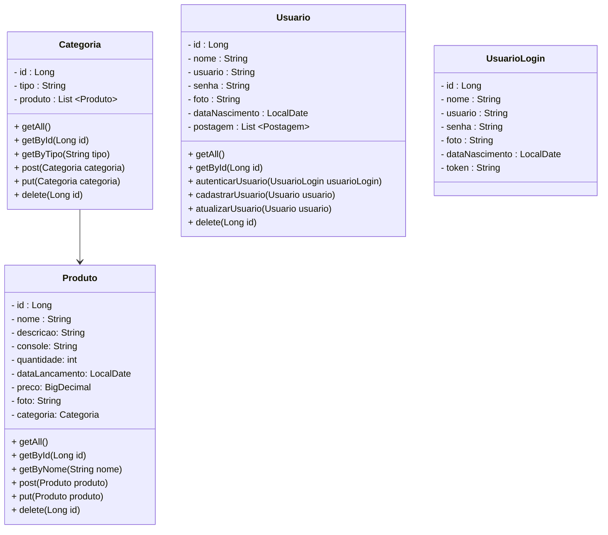

<h1>Projeto Loja de Games</h1>

## Diagrama de Classes

<h2>Etapas:</h2>

- [x] Criar o Projeto Spring
- [x] Configurar as Dependências do Projeto
- [x] Configurar o Banco de dados
- [x] Criar a Camada Model
- [x] Criar a Camada Repository
- [x] Criar a Camada Controller
- [x] Criar o Relacionamento entre as 2 classes
- [x] Fazer os testes no Insomnia

<a href="https://lojagengames.herokuapp.com/" target="_blank">Deploy no Heroku</a>

